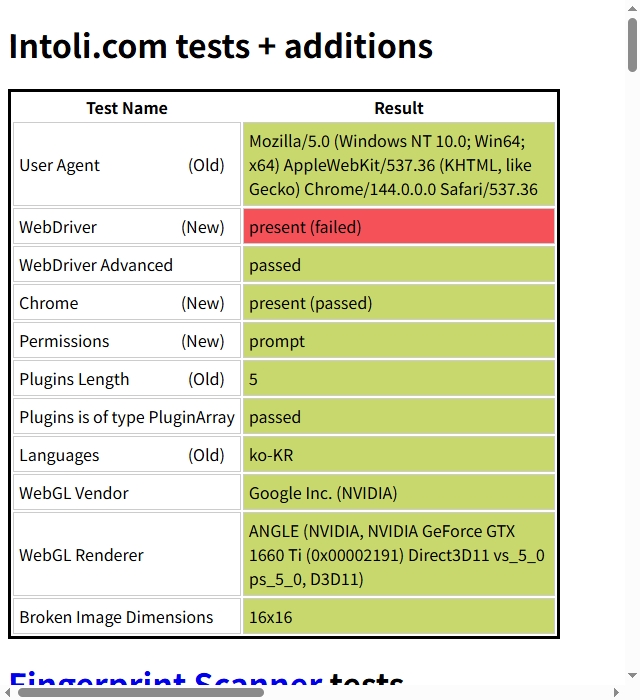
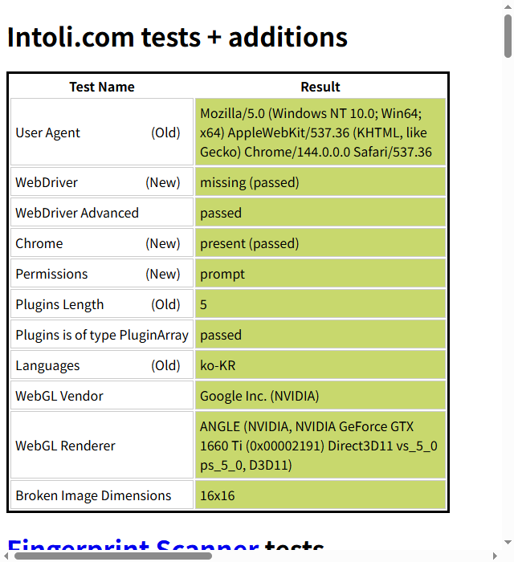

# playwright-bot-bypass

> 🔥 Camofox + Nitter blocked? This works as an alternative for Twitter/X scraping without login.

Claude Code skill to bypass bot detection using `rebrowser-playwright` (Node.js) or `undetected-chromedriver` (Python).

## Installation

```
npx skills add greekr4/playwright-bot-bypass
```

## Features

- ✅ Pass bot.sannysoft.com all tests
- ✅ Google search without CAPTCHA
- ✅ Twitter/X scraping without login
- ✅ Real GPU fingerprint (Apple M2, NVIDIA, etc.)
- ✅ WebDriver property removed
- ✅ Works with Node.js and Python

## A/B Test: Standard vs Stealth

| Standard Playwright (Detected) | rebrowser-playwright (Bypassed) |
|:---:|:---:|
|  |  |

> Left: Standard Playwright exposes `navigator.webdriver = true` (red).
> Right: rebrowser-playwright removes it completely (green).

## Test Results

| Environment | bot.sannysoft.com | Google Search |
|-------------|-------------------|---------------|
| Standard Playwright | ❌ Detected | ❌ CAPTCHA |
| **rebrowser-playwright** | ✅ Pass | ✅ Works |
| playwright-stealth (Python) | ✅ Pass | ❌ CAPTCHA |
| **undetected-chromedriver** | ✅ Pass | ✅ Works |

## Quick Start

### Node.js (Recommended)

```bash
npm install rebrowser-playwright
```

```javascript
import { chromium } from 'rebrowser-playwright';

const browser = await chromium.launch({
  headless: false,
  channel: 'chrome'
});

const context = await browser.newContext();
await context.addInitScript(() => {
  delete Object.getPrototypeOf(navigator).webdriver;
});

const page = await context.newPage();
await page.goto('https://google.com');
```

### Python

```bash
pip install undetected-chromedriver
```

```python
import undetected_chromedriver as uc

# Check your Chrome version at chrome://version
driver = uc.Chrome(version_main=133)
driver.get('https://google.com')
```

## Why It Works

| Detection Point | Standard Playwright | This Solution |
|-----------------|---------------------|---------------|
| WebDriver | `navigator.webdriver = true` | Removed |
| WebGL Renderer | SwiftShader (software) | Real GPU |
| User Agent | HeadlessChrome | Clean Chrome |

## Scripts Included

- `skills/playwright-bot-bypass/scripts/bot-detection-test.mjs` - Test if bypass is working
- `skills/playwright-bot-bypass/scripts/stealth-template.mjs` - Reusable stealth browser template
- `skills/playwright-bot-bypass/examples/stealth-google-search.mjs` - Google search example
- `skills/playwright-bot-bypass/examples/ab-test.mjs` - Compare detected vs stealth
- `skills/playwright-bot-bypass/examples/stealth-twitter-scrape.mjs` - Twitter/X profile scraping

## License

MIT
